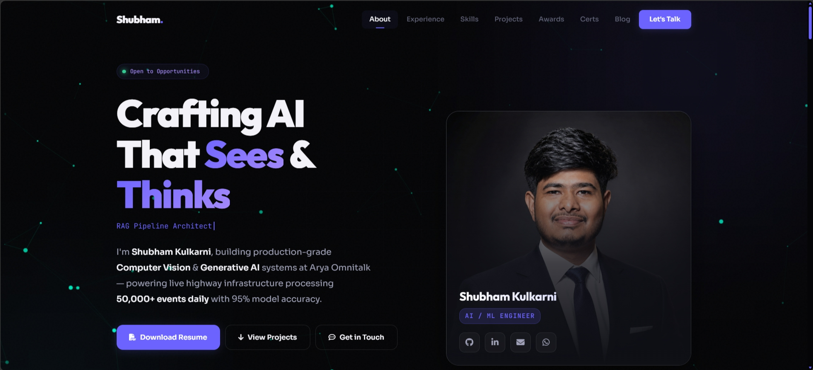

<div align="center">
    <h1 align="center">🚀 Personal Portfolio Website 🚀</h1>
    <p align="center">
        A modern, clean, and fully responsive personal portfolio website built to showcase my skills, projects, and journey as a developer.
        <br />
        <a href="https://kulkarnishub377.github.io/"><strong>View Live Demo »</strong></a>
        ·
        <a href="https://github.com/kulkarnishub377/kulkarnishub377.github.io/issues">Report Bug</a>
        ·
        <a href="https://github.com/kulkarnishub377/kulkarnishub377.github.io/issues">Request Feature</a>
    </p>
</div>

<!-- TABLE OF CONTENTS -->
<details>
    <summary><strong>Table of Contents</strong></summary>
    <ol>
        <li><a href="#-about-the-project">About The Project</a></li>
        <li><a href="#-built-with">Built With</a></li>
        <li><a href="#-key-features">Key Features</a></li>
        <li><a href="#-getting-started">Getting Started</a></li>
        <li><a href="#-roadmap">Roadmap</a></li>
        <li><a href="#-contact">Contact</a></li>
        <li><a href="#-license">License</a></li>
    </ol>
</details>

---

### 🎯 About The Project

[](https://kulkarnishub377.github.io/)

This project serves as my digital resume and portfolio. It's a carefully crafted space where I present my professional journey, technical skills, and the projects I'm passionate about. The goal was to create an engaging, accessible, and visually appealing platform for visitors, recruiters, and fellow developers.

---

### 🛠️ Built With

This portfolio is built with a combination of modern web technologies, focusing on performance, maintainability, and a great user experience.

*   [![HTML5][HTML5-shield]][HTML5-url]
*   [![CSS3][CSS3-shield]][CSS3-url]
*   [![JavaScript][JavaScript-shield]][JavaScript-url]
*   [![GSAP][GSAP-shield]][GSAP-url]
*   [![Git][Git-shield]][Git-url]
*   [![GitHub][GitHub-shield]][GitHub-url]
*   [![Font Awesome][Font-Awesome-shield]][Font-Awesome-url]
*   [![Google Fonts][Google-Fonts-shield]][Google-Fonts-url]

---

### ✨ Key Features

*   **📱 Fully Responsive Design:** Adapts seamlessly to any screen size, from mobile phones to widescreen desktops.
*   **🎨 Interactive UI/UX:** Features a dynamic momentum-based particle background, smooth GSAP animations, and custom cursor interactions.
*   **📂 Project Showcase:** A dedicated section to display my work with links to live demos and source code on GitHub.
*   **🧭 Dynamic Scroll Indicators:** Includes an interactive circular progress ring on the Back-to-Top button that fills as you scroll.
*   **💡 Skills Overview:** Clearly lists my technical skills and proficiencies with intuitive icons.
*   **📨 Contact Form:** A simple and effective way for visitors and potential employers to get in touch.
*   **⚡ Fast & Lightweight:** Optimized for performance to ensure a quick and smooth browsing experience.

---

### 🏁 Getting Started

To get a local copy up and running, follow these simple steps.

#### Prerequisites

You only need a modern web browser to view the project. No special software or dependencies are required.

#### Installation

1.  Clone the repository to your local machine:
        ```sh
        git clone https://github.com/kulkarnishub377/kulkarnishub377.github.io.git
        ```
2.  Navigate to the project directory:
        ```sh
        cd kulkarnishub377.github.io
        ```
3.  Open the `index.html` file in your favorite browser to view the website.

---

### 🗺️ Roadmap

**Phase 1: Foundation (Completed) ✅**
*   [x] Set up modern HTML5 structure and CSS variables.
*   [x] Implement fully responsive layouts for mobile and desktop.
*   [x] Add interactive project showcase and skills section.

**Phase 2: UI/UX Enhancements (Completed) ✅**
*   [x] Add a dedicated blog section for articles and tutorials.
*   [x] Integrate GSAP for premium interactive UI elements and animations.
*   [x] Implement momentum-based 3D particle network background.
*   [x] Add dynamic scroll progress indicators to navigation.
*   [x] Add a custom 404 page for better user experience.

**Phase 3: Optimization & Future Goals (In Progress) ⏳**
*   [x] Update and perfectly align hero assets and headshots.
*   [ ] Implement a dark/light mode toggle for user preference.
*   [ ] Refactor CSS: remove legacy dead code and consolidate media queries.
*   [ ] Add CSS/JS minification for production deployment.

See the [open issues](https://github.com/kulkarnishub377/kulkarnishub377.github.io/issues) for a full list of proposed features (and known issues).

---

### 📫 Contact

**Shubham Kulkarni**

Feel free to connect with me!

*   **Email:** [kulkarnishub377@gmail.com](mailto:kulkarnishub377@gmail.com)
*   **LinkedIn:** [linkedin.com/in/shubhkulk21](https://www.linkedin.com/in/shubhkulk21/)
*   **GitHub:** [github.com/kulkarnishub377](https://github.com/kulkarnishub377)

---

### 📄 License

Distributed under the MIT License. See `LICENSE` for more information.

<!-- MARKDOWN LINKS & IMAGES -->
[HTML5-shield]: https://img.shields.io/badge/HTML5-E34F26?style=for-the-badge&logo=html5&logoColor=white
[HTML5-url]: https://developer.mozilla.org/en-US/docs/Web/Guide/HTML/HTML5
[CSS3-shield]: https://img.shields.io/badge/CSS3-1572B6?style=for-the-badge&logo=css3&logoColor=white
[CSS3-url]: https://developer.mozilla.org/en-US/docs/Web/CSS
[JavaScript-shield]: https://img.shields.io/badge/JavaScript-F7DF1E?style=for-the-badge&logo=javascript&logoColor=black
[JavaScript-url]: https://developer.mozilla.org/en-US/docs/Web/JavaScript
[GSAP-shield]: https://img.shields.io/badge/GSAP-88CE02?style=for-the-badge&logo=greensock&logoColor=white
[GSAP-url]: https://greensock.com/gsap/
[Git-shield]: https://img.shields.io/badge/Git-F05032?style=for-the-badge&logo=git&logoColor=white
[Git-url]: https://git-scm.com/
[GitHub-shield]: https://img.shields.io/badge/GitHub-181717?style=for-the-badge&logo=github&logoColor=white
[GitHub-url]: https://github.com
[Font-Awesome-shield]: https://img.shields.io/badge/Font_Awesome-528DD7?style=for-the-badge&logo=fontawesome&logoColor=white
[Font-Awesome-url]: https://fontawesome.com
[Google-Fonts-shield]: https://img.shields.io/badge/Google_Fonts-4285F4?style=for-the-badge&logo=googlefonts&logoColor=white
[Google-Fonts-url]: https://fonts.google.com/